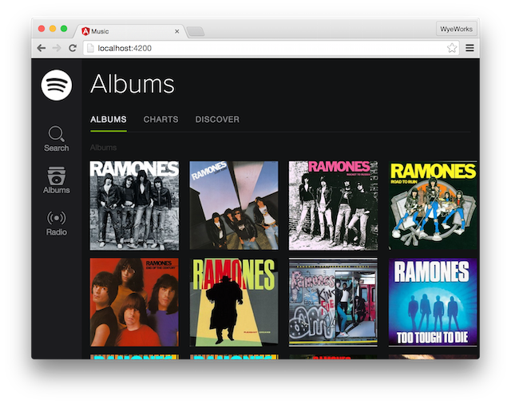
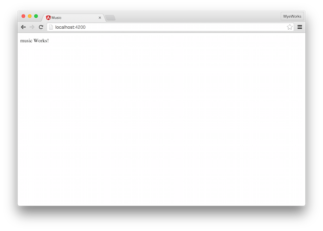
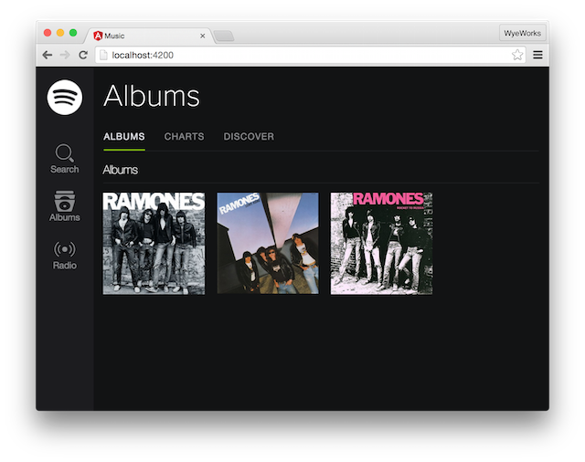
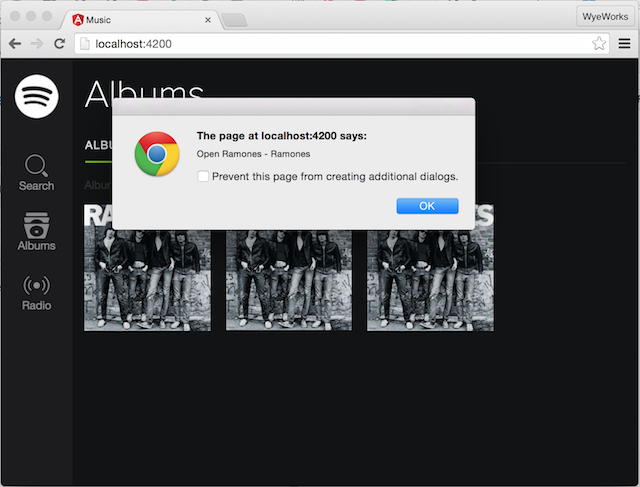
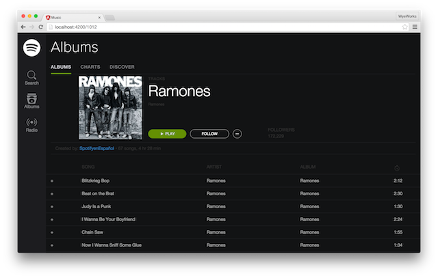

# Workshop: Angular 2 with angular-cli



This repo contains the sources and step by step instructions for the workshop
done on 11/2015 at the [Montevideo Angular
meetup](http://www.meetup.com/Angular-MVD/events/224558648/)

## Overview

The idea was to build an Angular 2 application from scratch using
`angular-cli`.

All assets to reproduce the workshop can be found in [sources/](./sources)
folder.

You can find each step as a commit of this repo, so go to
https://github.com/san650/angular-workshop-meetup-2015-11/commits/master and
follow this step by step by looking at the corresponding commits.

## Step by step

Disclaimer: Angular 2.0 and `angular-cli` are in alpha releases, so things will
break!

### 0. Pre-requisites

* [Node](https://nodejs.org/download/release/v4.1.1/) >= v4.1.0

You can test which version of node you have on a terminal

```
$ node -v
v4.1.1
```

### 1. angular-cli



`angular-cli` provides a tooling for Angular 2.0 projects. Some of the highlights:

* Defines a project structure based on conventions using best practices
* Development server
* Test runner
* Blueprints (generators) for components, services, pipes and tests
* Addons

#### 1.1 Install angular-cli tool

Install `angular-cli` tool

```
$ npm install -g angular-cli
$ ng --version
version: 1.13.8
node: 4.1.1
npm: 2.14.9
os: darwin x64
```

#### 1.2 Generate new Angular 2.0 project

Generate the Angular 2.0 application using the `ng` command and start the
development server.

```
$ ng new music
$ cd music/
$ ng serve
```

Note that on Windows you need to start the development server using Admin
permissions [1](https://github.com/angular/angular-cli#known-issues).

### 2. Creating base structure



#### 2.1 Copy assets to src/ folder

Copy the assets to the project

```
$ cp sources/vendor.css src/vendor.css
$ cp sources/music.css src/app/music.css
$ cp sources/music.html src/app/music.html
$ cp sources/images src/images/
```

#### 2.2 Link vendor.css

Include `vendor.css` in `src/index.html` file

```html
<link rel="stylesheet" type="text/css" href="vendor.css">
```

#### 2.3 Reference to component's CSS file

Tell `music` component to load it's CSS file. This is done by passing the
`styleUrls` parameter to the component definition.

```js
@Component({
...
styleUrls: ['app/music.css'],
...
})
```

### 3. Components



Let's create a component that represents the grid of albums.

```
$ ng generate component albums-page
version: 1.13.8
installing component
  create src/app/components/albums-page/albums-page.css
  create src/app/components/albums-page/albums-page.html
  create src/app/components/albums-page/albums-page.ts
installing component-test
  create src/app/components/albums-page/albums-page.spec.ts
```

The folder structure now is

```
$ tree -I 'node_modules|dist|temp|images' src/
src/
├── app
│   ├── components
│   │   └── albums-page
│   │       ├── albums-page.css
│   │       ├── albums-page.html
│   │       ├── albums-page.spec.ts
│   │       └── albums-page.ts
│   ├── music.css
│   ├── music.html
│   └── music.ts
├── app.ts
├── favicon.ico
├── index.html
├── tsconfig.json
└── vendor.css

3 directories, 13 files
```

We have to move the HTML of the albums grid to
`src/app/components/albums-page/albums-page.html`.

Once we created the new component we can use it from the main component.

```html
<albums-page></albums-page>
```

and on the JavaScript side we have to register the component

```js
import {AlbumsPage} from './components/albums-page/albums-page';

@Component({
  selector: 'music-app',
  ...
  directives: [AlbumsPage],
  ...
})
```

We do the same for `album-cover` component (take a look at the corresponding
commits).

#### 3.1 Bind attributes

To bind an attribute to the style tag we have to use the `[attribute]="value"`
notation.

Suppose our context has an album object with an image attribute, so our template
would be:

```html
<div class="col-sm-3 col-md-3 col-lg-2 media default image-grid genre">
  <a>
    <div class="genreImage" [style.background-image]="'url('+album.image+')'" (click)="open()"></div>
  </a>
</div>
```

and the javascript side of the component would be

```js
...
export class AlbumCover {
  album: any;

  constructor() {
    this.album = {
      image: 'images/ramones-ramones.jpg'
    };
  }
}
```

#### 3.2 Handle click event

To handle click event you have to use the `(click)="handler()"` syntax.

```html
<div class="col-sm-3 col-md-3 col-lg-2 media default image-grid genre">
  <a>
    <div class="genreImage" [style.background-image]="'url('+album.image+')'" (click)="open()"></div>
  </a>
</div>
```

and you need to declare the attribute `model` as an attribute of the class in
order to use it from the click handler `open`.

```js
...
export class AlbumCover {
  album: any;

  constructor() {
    this.album = {
      id: 1000,
      image: 'images/ramones-ramones.jpg',
      artist: 'Ramones',
      name: 'Ramones'
    };
  }

  open() {
    alert("You selected " + this.album.artist + " - " + this.album.name);
  }
}
```

### 4. Fetch albums from an external service


We're going to simulate an external HTTP API so we're going to fetch albums.

#### 4.1 Copy dummy json file

Copy the `albums.json` to `src/` folder.

```
$ cp sources/albums.json src/
```

#### 4.2 Register `http` dependency

We need to do a couple of steps here

1. Import angular2/http js file
2. Register the HTTP module so it can be injected in our app

For the first step we need to register the file on `index.html`

```html
<script src="vendor/angular2/bundles/http.dev.js"></script>
```

For the second step we import `HTTP_PROVIDERS` from `angular2/http` file and
then we add it as a dependency to the bootstrap.

```js
import {bootstrap} from 'angular2/angular2';
import {HTTP_PROVIDERS} from 'angular2/http';
import {MusicApp} from './app/music';

bootstrap(MusicApp, [HTTP_PROVIDERS]);
```

#### 4.3 Load the list of albums

Let's read the list of albums from the context and iterate using the `ngFor`
directive. Let's create it in two steps, first load the list of albums from an
array and then from a json file using the `http` service.

We'll change the template app/components/albums-page/albums-page.html to
generate the list of album covers.

```html
<div class="row fivecolumns">
  <album-cover *ng-for="#album of albums" [album]="album"></album-cover>
</div>
```

And on the JavaScript side return the list of albums

src/app/music.ts

```js
import {Component} from 'angular2/angular2';
import {AlbumCover} from '../album-cover/album-cover';

@Component({
  selector: 'albums-page',
  templateUrl: 'app/components/albums-page/albums-page.html',
  styleUrls: ['app/components/albums-page/albums-page.css'],
  providers: [],
  directives: [AlbumCover],
  pipes: []
})

export class AlbumsPage {
  albums: any = [];

  constructor(private http:Http) {
    http
      .get("/albums.json")
      .map(response => response.json()["albums"])
      .subscribe(albums => this.albums = albums)
  }

}
```

Also note that we're passing `album` as an attribute the current `album-cover`
component. On that component we can use the `album` object as follows.

```ts
import {Component} from 'angular2/angular2';
import {Router} from 'angular2/router';

@Component({
  selector: 'album-cover',
  templateUrl: 'app/components/album-cover/album-cover.html',
  styleUrls: ['app/components/album-cover/album-cover.css'],
  providers: [],
  directives: [],
  pipes: [],
  properties: ['album']
})
export class AlbumCover {
  album: any;

  constructor() {
  }

  open() {
    alert('Open ' + this.album.artist + ' - ' + this.album.name);
  }
}
```

More info about [`http`](https://angular.io/docs/js/latest/api/http/Http-class.html).

### 5. Routes



Let's see how to use the routing facilities Angular 2.0 brings

#### 5.1 Register router provider

To start using the routing facilities, we need to do a couple of things first:

1. Include the JavaScript file
2. Register the router providers in the application.

So, first we need to include the JavaScript file as follows

src/index.html

```html
...
  <script src="vendor/angular2/bundles/router.dev.js"></script>
...
```

then we have to include the providers in the application.

src/app.ts

```js
import {bootstrap} from 'angular2/angular2';
import {HTTP_PROVIDERS} from 'angular2/http';
import {ROUTER_PROVIDERS} from 'angular2/router';
import {MusicApp} from './app/music';

bootstrap(MusicApp, [HTTP_PROVIDERS, ROUTER_PROVIDERS]);
```

#### 5.2 Create root route `/`

Import `RouterConfig` which allows to define the routes. Also import the router
directives to use in the templates.

First we register the root route and indicate that it should load the
`AlbumsPage` component.

src/app/music.ts

```js
...
import {RouteConfig, ROUTER_DIRECTIVES} from 'angular2/router';
...

@RouteConfig([
  {
    path:"/",
    as: "Albums",
    component: AlbumsPage
  }
])
@Component({
  directives: [ROUTER_DIRECTIVES],
  pipes: []
})
export class MusicApp {
...
```

And then we indicate where do we want to render the components in the template
using the `<router-outlet>` directive.

```html
<router-outlet></router-outlet>
```

and that's it. If we reload the page, the root path it's going to be load.

#### 5.3 Adding a child route

First, let's add another page (component).

```
$ ng generate tracks-page
```

and copy the template and CSS from the sources/ folder.

Then register the route and make the click on the album covers to navigate to
this route.

src/app/components/album-cover/album-cover.ts

```js
...
import {Router} from 'angular2/router';

...
export class AlbumCover {
  album: any;

  constructor(private router:Router) {}

  open() {
    this.router.navigate(['Tracks']);
  }
}
```

### 6 Services

Services are useful to tackle cross app functionality like data store access. In
this case we're going to build a services named Store and move the `http` calls
to there.

To generate a service class just do

```
$ ng generate service store
```

and the code would be something like

```js
import {Injectable} from 'angular2/angular2';
import {Http} from 'angular2/http';

@Injectable()
export class Store {

  constructor(private http: Http) {}

  allAlbums() {
    return this
      .http
      .get('/albums.json')
      .map(response => response.json()["albums"]);
  }
}
```

## Thanks

This workshop was possible thanks to the great
[Spotyngular](https://github.com/iranreyes/spotyngular) application built by
[Irán Reyes](https://github.com/iranreyes)

## Resources

[Montevideo Angular Meetup](http://www.meetup.com/Angular-MVD/events/224558648/)
[The Spotyngular Project](https://github.com/iranreyes/spotyngular) by Iran Reyes
[The Spotyngular Project](http://uruit.com/2015/10/29/benefits-and-tricks-of-angularjs-2-the-spotyngular-project/) - A series of blog posts by Iran Reyes
[Angular 2](https://angular.io/docs/ts/latest/) documentation
[angular-cli](https://github.com/angular/angular-cli) github
